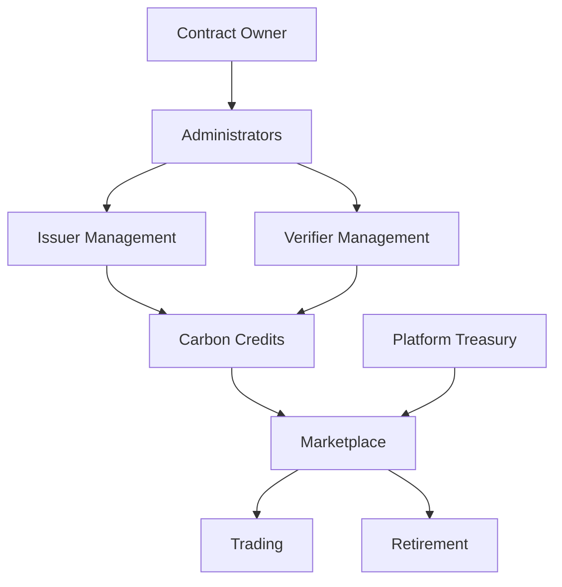

# CarbonMint - Carbon Credit Marketplace

A decentralized marketplace for trading verified carbon credits on the Stacks blockchain.

## Overview

CarbonMint provides a transparent and efficient platform for trading verified carbon credits. The marketplace enables:

- Carbon credit issuers to mint tokenized credits
- Verified projects to get their credits certified
- Buyers to purchase and retire carbon credits
- Full transparency and traceability of credit lifecycle

The platform eliminates intermediaries while maintaining the integrity of environmental claims through immutable records of issuance, ownership, and retirement.

## Architecture



The smart contract implements a multi-role system with:
- Contract owner and administrators for governance
- Authorized issuers who can mint new credits
- Verified bodies who certify credits
- Marketplace participants who can buy, sell, and retire credits

## Contract Documentation

### Core Components

#### Role Management
- Contract owner and administrators
- Authorized carbon credit issuers
- Verified certification bodies

#### Carbon Credits
- Unique credit IDs
- Metadata including vintage year, project type, location
- Verification status tracking
- Ownership and balance management

#### Marketplace
- Active listings tracking
- Buy/sell functionality
- Platform fee management
- Credit retirement system

### Key Functions

#### Admin Functions
```clarity
(add-administrator (address principal))
(set-platform-fee-percentage (new-percentage uint))
(set-platform-treasury (new-treasury principal))
```

#### Issuer Management
```clarity
(register-issuer (issuer principal) (name (string-ascii 100)))
(update-issuer-status (issuer principal) (is-active bool))
```

#### Carbon Credit Lifecycle
```clarity
(issue-carbon-credits (vintage-year uint) (project-type (string-ascii 50)) ...)
(verify-carbon-credit (credit-id uint))
(transfer-credits (credit-id uint) (recipient principal) (amount uint))
(retire-credits (credit-id uint) (amount uint) (purpose (string-ascii 100)))
```

#### Marketplace Operations
```clarity
(list-credits (credit-id uint) (amount uint) (price-per-unit uint))
(buy-credits (listing-id uint) (amount uint))
(cancel-listing (listing-id uint))
```

## Getting Started

### Prerequisites
- Clarinet
- Stacks wallet
- STX tokens for transactions

### Installation
1. Clone the repository
2. Install dependencies with Clarinet
3. Deploy contract to desired network

### Basic Usage

1. **For Issuers:**
```clarity
;; Register as an issuer
(contract-call? .carbon-mint register-issuer 'SP2J6ZY48GV1EZ5V2V5RB9MP66SW86PYKKNRV9EJ7 "Clean Energy Corp")

;; Issue new credits
(contract-call? .carbon-mint issue-carbon-credits u2023 "Solar" "USA" "Gold Standard" u1000)
```

2. **For Buyers:**
```clarity
;; Buy credits from listing
(contract-call? .carbon-mint buy-credits u1 u100)

;; Retire credits
(contract-call? .carbon-mint retire-credits u1 u50 "Corporate Carbon Offset 2023")
```

## Development

### Testing
Run tests using Clarinet:
```bash
clarinet test
```

### Local Development
1. Start Clarinet console:
```bash
clarinet console
```
2. Deploy contract:
```clarity
(contract-call? .carbon-mint ...)
```

## Security Considerations

### Access Control
- Only authorized administrators can manage platform settings
- Only registered issuers can mint new credits
- Only certified verifiers can verify credits
- Credit transfers require ownership verification

### Platform Fees
- Maximum fee cap of 20%
- Fees automatically distributed to platform treasury
- Protected fee calculation with precision handling

### Credit Integrity
- Double-spending prevention
- Retirement tracking
- Verification requirements for trading
- Balance checks for all transfers

### Additional Safeguards
- Input validation for all operations
- Error handling for edge cases
- Proper decimal handling for calculations
- Active status checks for all participants